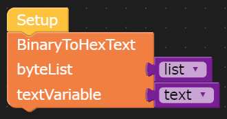

# BinaryToHexTextBlock-UIFlow
M5Stack社のUIFlowでByte型(0-255の数値)のリストを16進テキストに変換するブロックです。
ブロック内部の処理で、[binascii](https://docs.python.org/ja/3/library/binascii.html)を利用して変換をかけています。

## 使い方
byteListにByte型のリスト、textVariableに処理結果を格納するテキスト用変数を入れて使います。

## 例
M5Stack Core2向きに作成しました。

### example.m5f
データ変換表示サンプルです。
0-255以外の数値を入れた場合の処理もあえて入れています。

### example_serial.m5f
Groveで接続した相手から受信したデータを表示するサンプルです。
